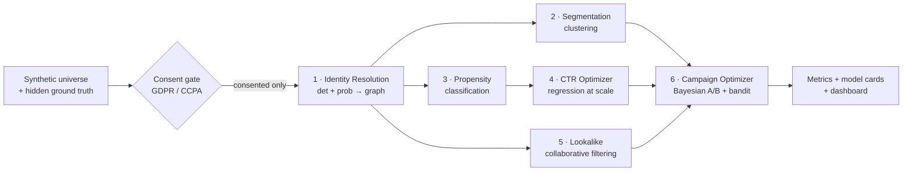

# AudienceGraph

**A privacy-safe identity resolution & audience activation platform, on Spark.**

AudienceGraph reconstructs which devices belong to the same person from raw
ad-tech signals, then uses those resolved profiles to power segmentation,
lookalike expansion, and campaign optimization — the same end-to-end arc as a
modern data-collaboration platform (onboard → resolve → analyze → activate).
It runs on a synthetic consumer universe with a **hidden ground-truth identity
graph**, so every model is scored against known truth instead of vibes.

> **The one-liner:** *I built a privacy-safe synthetic identity graph with known
> ground truth, resolved cross-device identities with deterministic +
> probabilistic matching that nearly doubled recall at ~91% precision, and used
> the resolved profiles to drive segmentation, lookalike modeling, and campaign
> optimization — all on Spark, evaluated against ground truth at every step.*

---

## Why this project

Identity resolution, audience segmentation, and performance optimization are
statistical-modeling problems on very large, messy data. My research background
is large-scale Bayesian inverse modeling (recovering hidden structure from noisy,
indirect observations under uncertainty) — which is exactly the shape of
cross-device identity resolution: the person is latent, the device signals are
noisy and partial, and you must quantify how confident a merge is before you act
on it. This repo is that skill set, expressed in the ad-tech domain and the
ad-tech stack.

## How each job requirement maps to a concrete deliverable

| Requirement (from the JD) | Where it lives in this repo |
|---|---|
| **Identity resolution** | Module 1 — deterministic + probabilistic matcher → connected-components graph (`src/identity/`) |
| **Cross Device** | Module 1 stitches cookies / MAIDs / hashed-emails / IPs into one person |
| **Graph algorithms** | Connected components implemented from scratch in PySpark (`src/common/connected_components.py`) |
| **Classification** | Probabilistic pairwise matcher (Module 1) + behavioral propensity (Module 3), both MLlib logistic / GBT |
| **Clustering** | Audience segmentation, K-means + GMM with model selection (Module 2) |
| **Regression** | CTR / conversion optimizer at scale, hashed logistic / FM (Module 4) |
| **Collaborative filtering** | Lookalike / audience expansion, ALS implicit feedback (Module 5) |
| **Bayesian data analysis** | Campaign optimizer — Bayesian A/B + Thompson-sampling bandit + hierarchical pooling (Module 6) |
| **Performance optimization / the "Optimizer"** | Modules 4 + 6 (propensity, budget allocation, creative bandit) |
| **Behavioral profiling & audience segmentation** | Modules 2 + 3 (interest features, named segments, propensity) |
| **Distributed computing at very large scale** | Every module is PySpark; the same code runs `spark-submit` on EMR (see below) |
| **AWS EMR / S3 / Athena** | Data + jobs read/write `s3://`; jobs run on EMR; results queryable in Athena (see "Running on AWS") |
| **Test & refine algorithms** | `pytest` unit tests + ground-truth eval + before/after ablations on every model |
| **Communicate results to stakeholders** | This README, per-model metrics in `reports/`, model cards, and the Release 3 dashboard |
| **Privacy-safe by design** | A GDPR/CCPA **consent gate** (`src/common/consent.py`) runs before any modeling |

## Architecture



Everything downstream consumes **resolved persons**, not raw devices — the way a
real activation stack works.

## Release status

This ships as an honest, runnable foundation, not vaporware.

| Release | Scope | Status |
|---|---|---|
| **R1 — Identity Resolution Engine** | consent gate, det + prob matcher, graph resolution, ground-truth eval | **Runnable now** — `make all` |
| R2 — Enrichment, Segmentation, Lookalikes | customer-360, K-means/GMM segments, ALS lookalike | Designed; in progress |
| R3 — Campaign Optimizer + Dashboard + AWS | propensity, budget allocation, MAB, Plotly dashboard, EMR/Athena | Designed; in progress |

---

## Release 1 — Identity Resolution Engine (the centerpiece)

**Problem.** Given only device-level signals (cookies, MAIDs, hashed emails,
IPs) plus a behavioral event log, decide which devices are the same person.
The trap: a household shares an IP, so naive IP-merging fuses different people;
the logged-out long tail has no shared email, so email-only matching misses them.

**Approach (in `src/identity/resolve.py`):**

1. **Consent gate.** Drop non-consented (GDPR) and opted-out (CCPA) people
   before anything else. Privacy is enforced structurally, and its cost in
   reachable audience is measured, not hidden.
2. **Deterministic matching.** Devices sharing a hashed email or MAID → same
   person. High precision, but limited recall.
3. **Probabilistic matching.** For device pairs that share only a household IP,
   a Spark MLlib logistic-regression matcher scores same-person vs
   same-household on a behavioral-similarity feature (content-affinity cosine).
   It operates at a **threshold chosen for ≥90% precision**, so it recovers real
   links without merging households.
4. **Graph resolution.** Union the edges and run connected components → one
   resolved id per person.
5. **Evaluation.** Pairwise precision / recall / F1 vs the hidden ground-truth
   person id, reported as an **ablation** so the probabilistic step's lift is
   measurable.

**Results** _(synthetic universe, 10,000 people; reproduce with `make all`)_:

<!-- METRICS:START -->
**Scale:** 8,414 consented persons · 20,941 devices in graph (from 10,000 people; consent gate retained 84.14%).

| Stage | Precision | Recall | F1 |
|---|---:|---:|---:|
| Deterministic only | 1.0 | 0.2524 | 0.4031 |
| **Deterministic + probabilistic** | **0.9144** | **0.4976** | **0.6445** |

- **Probabilistic matcher:** AUC **0.9623**, operated at threshold 0.885 (chosen for >=90% precision) over 39,756 candidate pairs.
- **F1 lift from the probabilistic step:** +0.2414 at 0.9144 precision (recovers true links without over-merging households).
- **Consent cost:** 1,003 suppressed for GDPR (no consent), 583 for CCPA (opt-out).
<!-- METRICS:END -->

The story these numbers tell: deterministic matching is precise but leaves the
logged-out tail unresolved (recall ~0.25); the probabilistic matcher nearly
doubles recall to ~0.50 at ~91% precision; and the whole thing respects consent
by construction. (Graph precision sits just under the matcher's pairwise
precision because connected components transitively closes edges — an honest
cost of the graph step, shown rather than hidden.)

---

## Quickstart

```bash
make setup                 # create .venv, install pinned deps (needs Java 17+ for Spark 4)
make data PEOPLE=20000     # generate the synthetic universe (scale with PEOPLE)
make identity              # run the identity engine, writes reports/identity_metrics.json
make test                  # unit tests (graph correctness, consent gate)
# or simply:
make all
```

Requires Python 3.9+ and a JDK 17+ (PySpark 4). No cluster needed — it runs in
Spark local mode on a laptop.

## Running on AWS (the same code, at scale)

The modules never hard-code the master or the paths, so scaling out is
configuration, not a rewrite:

```bash
# generate/land data in S3, then submit the job to an EMR cluster
python data/generate_data.py --people 100000000 --out s3://my-bucket/audiencegraph/synthetic
AG_SPARK_MASTER=yarn spark-submit --deploy-mode cluster src/identity/resolve.py \
    --data s3://my-bucket/audiencegraph/synthetic
```

- **S3** is the data lake (`--out s3://...`, Parquet).
- **EMR** runs the Spark jobs unchanged (`AG_SPARK_MASTER=yarn`, broadcast joins
  re-enabled on real executor memory).
- **Athena** queries the Parquet outputs (`reports/`, resolved graph) directly
  for stakeholder-facing SQL. _(AWS Solutions Architect Associate — the cloud
  layer is not hand-waving.)_

## Repository layout

```
audiencegraph/
├── data/generate_data.py        # synthetic consumer universe + hidden ground truth
├── src/
│   ├── common/
│   │   ├── spark.py              # Spark session (laptop == EMR)
│   │   ├── consent.py           # GDPR/CCPA consent gate (runs first, always)
│   │   └── connected_components.py  # graph algorithm, native PySpark
│   └── identity/resolve.py      # Release 1 — identity resolution engine
├── tests/                       # pytest: graph correctness, consent gate
├── reports/                     # committed metrics + model cards
├── Makefile                     # setup / data / identity / test
└── requirements.txt
```

## Algorithm index (for the reviewer in a hurry)

- **Graph:** `src/common/connected_components.py` — label-propagation connected components.
- **Classification:** `src/identity/resolve.py::train_probabilistic_matcher` — MLlib logistic regression, AUC-evaluated.
- **Clustering / Regression / Collaborative filtering / Bayesian:** Modules 2–6 (in progress; designs in the release table).
- **Ground-truth evaluation:** `pairwise_prf` — pairwise P/R/F1 from co-occurrence counts (scales without pair explosion).

## Privacy-safe design

No signal, feature, or model in this repo is derived from a person who has not
consented (GDPR) or who has opted out (CCPA). The gate is one auditable choke
point (`src/common/consent.py`) that every pipeline calls first, and it reports
exactly how much audience consent costs. That is the posture a privacy-first
data platform requires.

---

_Built by Emmanuel Njinju. Synthetic data only — no real user data is used or
required._
