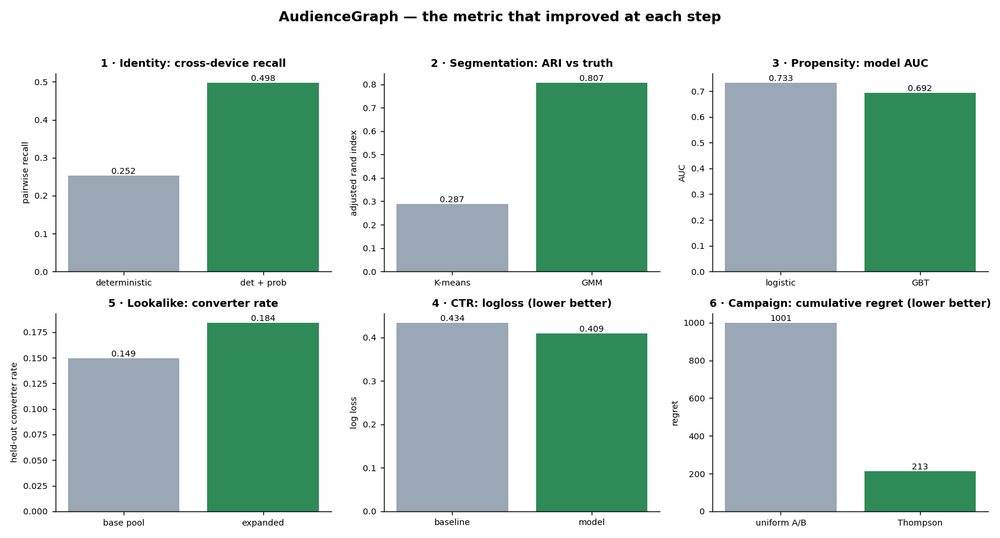

# AudienceGraph — Results Walkthrough

_One story, evaluated against hidden ground truth at every step. Every number below is read from a committed `reports/*_metrics.json`; regenerate with `make all-modules && python scripts/build_results.py`._

## 0 → 1 · Consent, then identity resolution
- Consent gate retained **84.14%** of people (1,003 GDPR + 583 CCPA suppressed).
- Cross-device recall **0.2524 → 0.4976** at **0.9144** precision (probabilistic matcher AUC 0.9623).

## 2 · Audience segmentation (clustering)
- **GMM ARI 0.8066** vs K-means 0.2874 at k=10 — soft/elliptical clusters match overlapping audiences better.

## 3 · Behavioral propensity (classification)
- Logistic AUC 0.7325 vs GBT 0.6924; **logistic regression wins (AUC 0.7325)**. Model choice is made on evidence, not fashion: the signal here is largely linear, so the simpler, interpretable, cheaper-to-serve model is also the more accurate one - and the one to ship.

## 5 · Lookalike expansion (collaborative filtering)
- Seeding on half the converters and expanding via ALS-predicted preference for the seed's characteristic items surfaces held-out converters at **0.1844** vs a 0.1494 base rate — a **1.234x lift**. (Modest by design: the synthetic catalog has only 12 items; ALS separates far better on a real high-cardinality catalog.)

## 4 · CTR / conversion optimizer (regression at scale)
- Hashed logistic regression on **1,466,163 impressions**: AUC **0.6693**, log loss 0.4086 vs 0.434 baseline (**5%** reduction).

## 6 · Campaign optimizer (Bayesian)
- Bayesian A/B identified the true best creative (**cr_4**, P(best)=0.9997, correct=True).
- Thompson sampling cut cumulative regret by **78%** vs uniform A/B, sending **74%** of impressions to the best arm.
